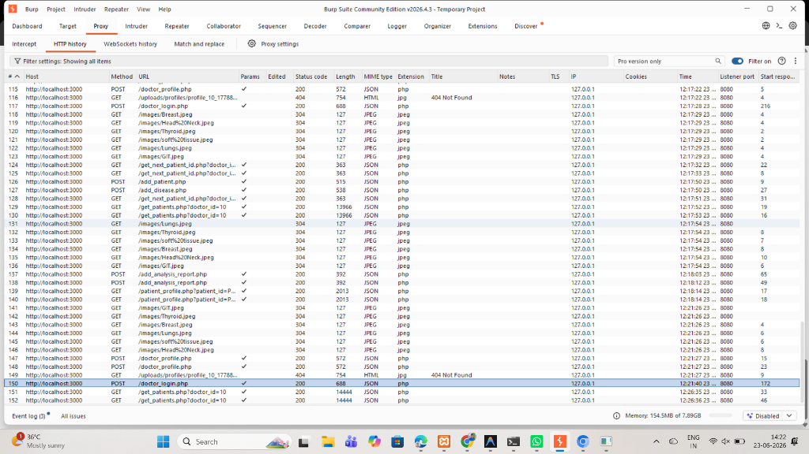
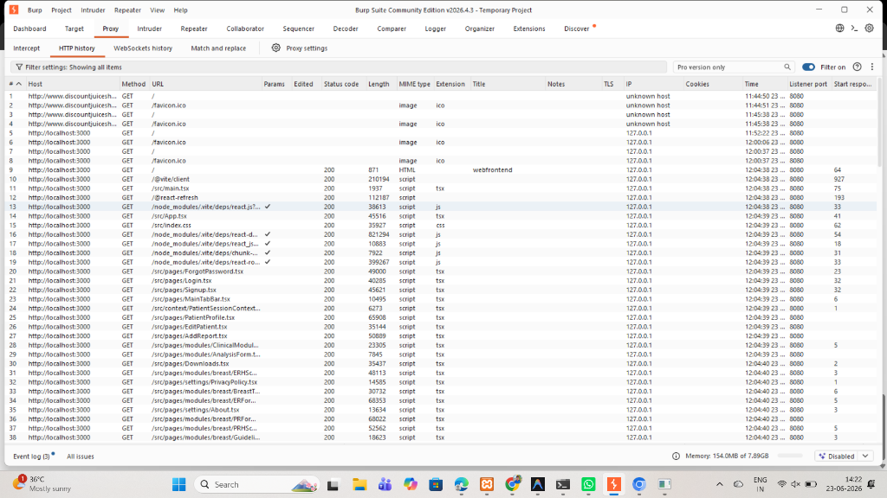
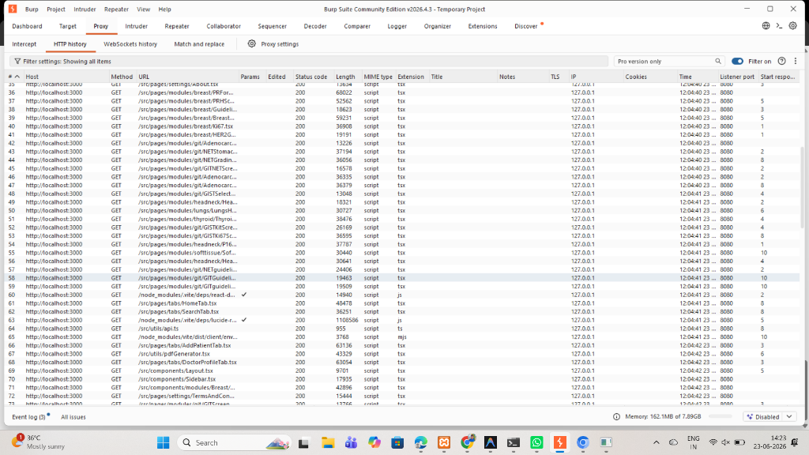
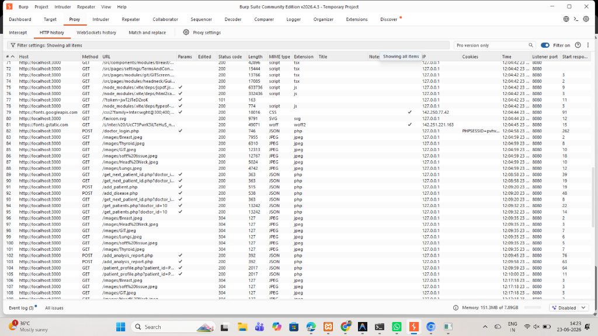
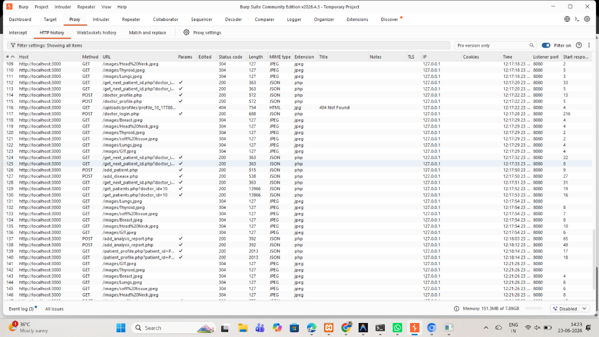

# Burp Suite Vulnerability Testing Logs

This directory contains the documented screenshots showing the full HTTP request history captured during manual security and vulnerability testing of the HistoQuanta web application using Burp Suite Community Edition.

## Screenshots

*   **Part 1 (Requests 1 - 38):** Initial connection and page routing loads.
    
*   **Part 2 (Requests 35 - 73):** Mapped React components and routing assets.
    
*   **Part 3 (Requests 71 - 108):** Frontend page assets loaded into the Burp proxy browser session.
    
*   **Part 4 (Requests 109 - 146):** Dynamic loads including clinical images and backend endpoint requests.
    
*   **Part 5 (Requests 115 - 152):** Backend requests including successful doctor login and patient queries.
    

## Vulnerability Scan Results

Manual security checks were conducted against the target endpoints:
1.  **SQL Injection Test on `/doctor_login.php` (license_no parameter):**
    *   **Payload:** `license_no=LT897'+OR+'1'='1&password=abc`
    *   **Result:** `{"status": false, "message": "Doctor not found"}`. Query is secure due to use of Parameterized SQL queries (prepared statements).
2.  **XSS Test on Patient Search Input:**
    *   **Payload:** ``
    *   **Result:** Plain-text search query handling (safely rendering `No matching patients found`). Confirmed secure against Cross-Site Scripting (XSS).
